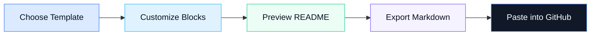

<div align="center">
  <h1>
    
    Profilo
  </h1>
  <p>
    A modern GitHub profile README builder with drag-and-drop blocks, live preview,
    role-based templates, and clean Markdown export.
  </p>

  <p>
    
    
    
    
  </p>
</div>

---

## Overview

Profilo helps developers create polished GitHub profile READMEs without manually writing complex Markdown. It combines a visual builder, live preview, reusable blocks, templates, and export-ready Markdown in one focused experience.

The project is designed to be fast, privacy-conscious, and client-side first. No account is required to build and export a profile.

## Highlights

| Capability | Description |
| --- | --- |
| Visual Builder | Add, edit, reorder, and remove README blocks with a smooth builder interface. |
| Live Preview | See generated Markdown output update as profile content changes. |
| Templates | Start quickly with role-based templates for different developer profiles. |
| Theme Support | Style generated README sections with reusable visual themes. |
| Markdown Export | Copy clean Markdown that is ready for a GitHub profile repository. |
| Privacy-first | Build and export without requiring sign-in or backend profile storage. |

## Workflow



## Features

- Drag-and-drop README builder with reusable profile blocks
- Real-time Markdown preview while editing
- Role-based templates for developer profiles
- GitHub-focused blocks for stats, activity, skills, projects, socials, and banners
- Customizable visual themes for README output
- Export-ready Markdown for GitHub profile repositories
- Responsive marketing pages and builder interface
- Client-side profile generation with no required login

## Tech Stack

| Area | Tools |
| --- | --- |
| Framework | Next.js 15, React 19 |
| Language | TypeScript |
| Styling | Tailwind CSS |
| State | Redux Toolkit |
| Motion | Framer Motion |
| Drag and Drop | DnD Kit |
| Markdown | React Markdown, Remark GFM, Rehype Raw |
| UI | Lucide React, Base UI, custom UI primitives |

## Getting Started

### Prerequisites

- Node.js 20 or later
- npm

### Install

```bash
npm install
```

### Run Development Server

```bash
npm run dev
```

Open `http://localhost:3000` in your browser.

If port `3000` is already in use, Next.js will automatically choose another available port.

### Build for Production

```bash
npm run build
```

### Start Production Server

```bash
npm run start
```

### Lint

```bash
npm run lint
```

## Project Structure

```text
src/
  app/
    (marketing)/        Marketing pages
    api/                API routes
    builder/            README builder page
  components/
    blocks/             Editable README block controls
    builder/            Builder UI components
    icons/              Custom icons
    layout/             Shared layout components
    ui/                 Reusable UI primitives
  lib/
    constants/          Shared constants
    markdown/           Markdown generation logic
    templates.ts        Profile template definitions
  store/                Redux state management
  types/                Shared TypeScript types
public/
  images/               Public image assets
```

## README Blocks

Profilo includes editable blocks for common developer profile sections:

| Profile Content | GitHub Visuals | Extra Sections |
| --- | --- | --- |
| Hero | GitHub stats | Terminal |
| About | Activity graph | Typing text |
| Skills | Trophies | Support links |
| Projects | Snake visual | Spotify |
| Experience | Pacman visual | Contact |
| Social links | Profile views | Blog posts |

## Privacy

Profilo is built with a privacy-conscious approach. Profile content is generated in the browser, and the app does not require authentication to build and export a README.

If a future API integration stores or processes user data, that data flow should be documented clearly before release.

## Development Notes

- Keep Markdown generation logic in `src/lib/markdown`.
- Keep shared domain types in `src/types`.
- Add new blocks through the block type definitions, default block factory, editor component, and Markdown generator.
- Prefer existing UI primitives and local patterns before adding new abstractions.
- Run TypeScript and lint checks before committing changes.

## Deployment

Profilo can be deployed on any platform that supports Next.js applications, including Vercel, Netlify, and Node.js servers.

For most hosted platforms, the production build command is:

```bash
npm run build
```

## Author

<div align="center">
  <p>
    Built and maintained by <strong>Seng Porkeat</strong>.
  </p>
</div>
